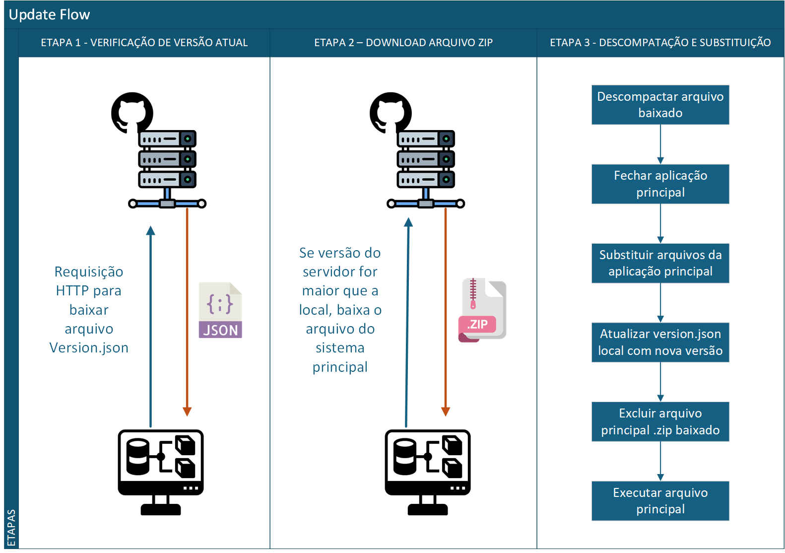

# Especificações do Projeto

## Personas

|            | João Pereira                      | Ana Souza                         | Empresa Alpha                          |
|------------|-----------------------------------|------------------------------------|---------------------------------------|
|            | 

 | 

 | 

 |
| Idade      | 40                                | 32                                 | -                                     |
| Ocupação   | Técnico de informática            | Desenvolvedora de software         | Empresa de suporte técnico            |
| Aplicativos | ● TeamViewer   ● Windows Explorer   ● Microsoft Teams | ● Slack   ● Trello   ● Visual Studio | ● Softwares corporativos   ● Gerenciadores de atualização |
| Motivações | ● Facilitar a instalação de atualizações em clientes remotos.   ● Evitar deslocamentos desnecessários. | ● Automatizar o ciclo de vida de seus projetos de software.   ● Garantir que todos os dispositivos da equipe estejam atualizados. | ● Reduzir o custo de manutenção e otimizar os processos internos. |
| Frustrações | ● Perde muito tempo com atualizações manuais.   ● Erros na instalação das atualizações causam retrabalho. | ● Problemas de sincronização entre versões antigas e novas dos softwares.   ● Falta de controle sobre as atualizações aplicadas. | ● Riscos de segurança devido a softwares desatualizados.   ● Ineficiência no gerenciamento centralizado das atualizações. |
| Hobbies | ● Tecnologia   ● Assistir filmes | ● Jogos de tabuleiro   ● Programação | ● Participar de feiras de tecnologia e inovação |
| História | João Pereira precisa de uma solução que permita aplicar atualizações remotamente, economizando tempo e garantindo que seus clientes tenham a melhor versão dos softwares. | Ana Souza busca um sistema que automatize a distribuição e aplicação de atualizações, reduzindo o risco de falhas em seu ambiente de desenvolvimento. | A Empresa Alpha quer implementar um sistema eficiente para gerenciar e aplicar atualizações de software em sua infraestrutura. |

---

## Histórias de Usuários

Com base na análise das personas, foram identificadas as seguintes histórias de usuários:

| **EU COMO...**           | **QUERO/PRECISO...**                                    | **PARA...**                                      |
|---------------------------|-------------------------------------------------------|-------------------------------------------------|
| João Pereira             | Aplicar atualizações remotamente                      | Economizar tempo e esforço.                    |
| Ana Souza                | Configurar atualizações automáticas                   | Evitar problemas de sincronização.             |
| Ana Souza                | Testar atualizações antes de distribuí-las            | Garantir a qualidade e estabilidade.           |
| Empresa Alpha            | Gerenciar atualizações em múltiplos dispositivos      | Reduzir riscos de segurança e inconsistências. |
| Empresa Alpha            | Gerar relatórios sobre o status das atualizações      | Monitorar e auditar os processos internos.     |

---

## Modelagem do Processo de Negócio

### Análise da Situação Atual

Atualmente, o processo de atualização de softwares é feito de maneira manual, enfrentando os seguintes problemas:

* **Complexidade e retrabalho**: Técnicos precisam acessar individualmente cada dispositivo para instalar atualizações.
* **Erros humanos**: A aplicação manual pode causar inconsistências nas versões instaladas.
* **Falta de automação**: Não há um sistema centralizado para monitorar ou distribuir atualizações.

Esses desafios tornam o processo lento e propenso a falhas, evidenciando a necessidade de uma solução automatizada.

---

### Descrição Geral da Proposta

A proposta é desenvolver uma aplicação desktop que automatize a distribuição e aplicação de atualizações em softwares de terceiros. A solução permitirá que usuários agendem, monitorem e validem atualizações de maneira centralizada.

**Limitações da Proposta:**

* A aplicação não realizará atualizações de sistemas operacionais.

**Ligações com Estratégias e Objetivos do Negócio:**

* **Eficiência Operacional**: Reduzir custos e melhorar a eficiência do processo de atualização.
* **Experiência do Usuário**: Minimizar interrupções causadas por processos de atualização manual.

**Oportunidades de Melhoria:**

* Reduzir o tempo necessário para aplicar atualizações.
* Garantir maior controle e segurança no processo.

---

### Processo 1 – APLICAÇÃO DE ATUALIZAÇÕES

**Oportunidades de Melhoria:**

* Automatização completa do processo de instalação de atualizações.

---

## Indicadores de Desempenho

| **INDICADOR**                | **OBJETIVO**                                  | **DESCRIÇÃO**                                           | **CÁLCULO**                                             | **FONTE DE DADOS**                | **PERSPECTIVA**                  |
|------------------------------|----------------------------------------------|-------------------------------------------------------|-------------------------------------------------------|------------------------------------|----------------------------------|
| Taxa de sucesso nas atualizações | Garantir a estabilidade das atualizações      | Avaliar a porcentagem de atualizações bem-sucedidas.   | (Atualizações bem-sucedidas / Total de atualizações) * 100 | Logs do sistema                   | Operações                        |
| Tempo médio de atualização    | Reduzir o tempo de aplicação das atualizações | Tempo médio gasto na aplicação de atualizações.        | Soma do tempo de todas as atualizações / Total        | Logs do sistema                   | Experiência do usuário           |
| Taxa de rejeição de atualizações | Identificar problemas de aceitação             | Porcentagem de atualizações rejeitadas pelos usuários. | (Atualizações rejeitadas / Total de atualizações) * 100 | Feedback dos usuários             | Melhoria contínua                |
| Taxa de adoção da aplicação   | Medir a aceitação do sistema                  | Comparação entre instalações novas e ativas.           | (Instalações ativas / Total de instalações) * 100    | Sistema de métricas               | Expansão do produto              |

---

## Requisitos

### Requisitos Funcionais

| **ID**  | **Descrição do Requisito**                                | **Prioridade** |
|---------|-----------------------------------------------------------|----------------|
| RF-001  | Permitir a configuração de atualizações automáticas       | Alta           |
| RF-002  | Notificar o usuário sobre o status das atualizações       | Alta           |
| RF-003  | Gerar relatórios automáticos sobre o processo             | Média          |
| RF-004  | Permitir cancelar atualizações em andamento               | Média          |
| RF-005  | Oferecer interface para monitoramento centralizado        | Alta           |

### Requisitos Não Funcionais

| **ID**   | **Descrição do Requisito**                               | **Prioridade** |
|----------|----------------------------------------------------------|----------------|
| RNF-001  | O sistema deve operar de forma responsiva e intuitiva    | Alta           |
| RNF-002  | Deve ser compatível com o sistema Windows                | Alta           |
| RNF-003  | O sistema deve garantir a segurança das atualizações     | Alta           |
| RNF-004  | Deve ser desenvolvido em C#                              | Alta           |

---

## Restrições

| **ID**   | **Descrição da Restrição**                               |
|----------|----------------------------------------------------------|
| RE-001   | A equipe não poderá terceirizar o desenvolvimento.       |
| RE-002   | O sistema será desenvolvido exclusivamente em C# WPF.  |
